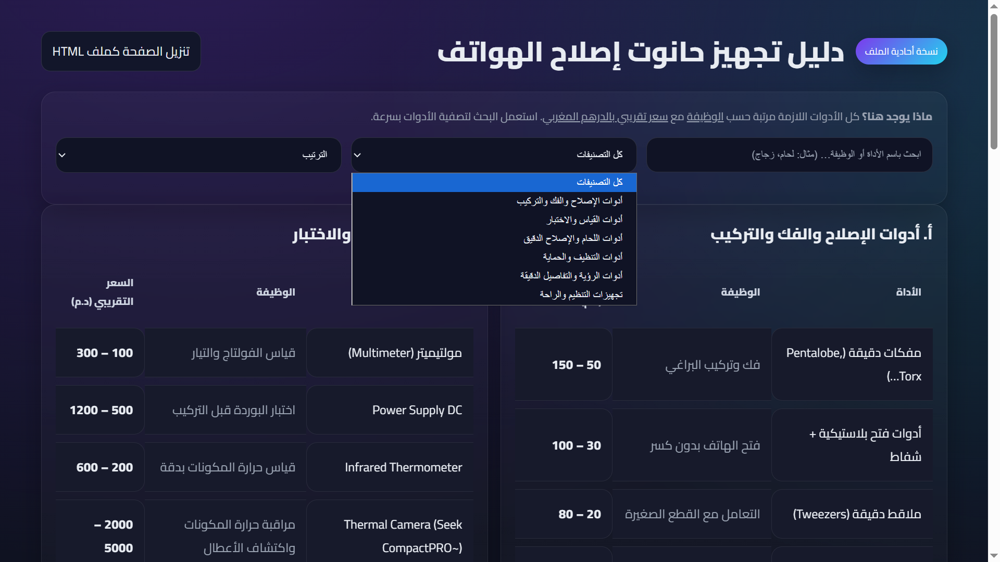

# 🛠️ Phone Repair Shop Guide
> A minimalist, modern dashboard for mobile technicians in Morocco to track essential tools and market prices.

[**Live Demo**](https://ayoub-maroc.github.io/phone-tool-kit/) • [**Report Issue**](https://github.com/ayoub-maroc/phone-tool-kit/issues)

---

### 📦 Overview
**Phone Tool Kit** is a specialized web application designed to help hardware technicians set up their professional workshops. It provides a curated database of tools, their specific functions, and estimated market costs in Moroccan Dirham (MAD).

### ✨ Key Features
* **📊 Tool Categories**: Organized sections for Repair, Assembly, and Testing.
* **💰 Local Pricing**: Estimated costs based on the Moroccan hardware market.
* **🔍 Live Filter**: Instant search by tool name or function (e.g., "Multimeter", "لحام").
* **📱 Responsive & RTL**: Optimized for Arabic text and mobile viewing.
* **💾 Offline Export**: Feature to download the entire guide as a standalone HTML file.

---

### 🖼️ Preview
<p align="center">
  
  <br>
  <i>Modern Dark UI with Glassmorphism effects.</i>
</p>

---

### 🛠️ Built With
* **Frontend**: HTML5 & Modern CSS3 (Grid/Flexbox).
* **Interactivity**: Vanilla JavaScript (ES6+).
* **Animations**: AOS (Animate On Scroll) for a smooth feel.

---

### 🚀 Getting Started
To run this project locally, no build process is needed:

1. **Clone the repository**:
   ```bash
   git clone [https://github.com/ayoub-maroc/phone-tool-kit.git](https://github.com/ayoub-maroc/phone-tool-kit.git)
